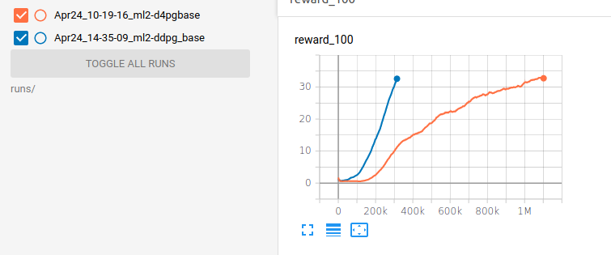
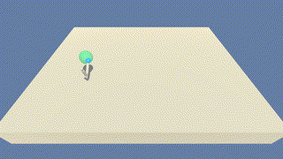

# P2 - Continuous Control Report

## Introduction
This turned out to be quite easy as D4PG and DDPG, converged in (almost) a straight line
to average reward (over 100 episodes) of 33.

In full disclosure, however, this was just the tip of the iceberg. While going through the lessons,
I "implemented" (or worked with different implementations) of each algorithm 
(with the exception of PPO, that was somewhat misplaced and not really explained) and tried it
on a number of problems (Pendulum, Lander, Mountaincar, BipedalWalker, MinitaurBulletEnv and some on Pong and Breakout).

Miguel did an excellent job on the lessons and explained everything very clearly - which made
it so much easier to actually understand the code. 
A very stark contrast to the abysmal DQN lessons that just listed the papers and provided some hand-wavy comments.
I don't really understand why, as the DQN extensions are important even in D4PG.

## Implementation
I chose to start with the single agent environment because adjustment to multi-agent would require
substantial changes to the unity env wrapper I created for the project 1. I will definitely come
back to it, though.
I tried to spin multiple environments using different port numbers but it crashed with `Ran Out of Input` error. 
As such A2C and A3C were not possible so I went straight to D4PG. From my previous tests,
D4PG managed to get the best results for most of the environments.

My implementation is based on the book Deep Reinforcement Learning Hands On, Second Edition by Maxim Lapan.
It's using external library ptan to replace a lot of the boilerplate code. Without understanding
of this library, the code may appear more complex (that was the feedback I got on P1), however,
I really got used to it and I prefer it and the sort of similar structure it gives to implementations
of various algorithms.

The code is heavily commented and should be quite simple to read and understand. 
The only part of the code that is not really explained is the distribution projection
function in D4PG. I can follow it and kind of see the math behind it, but I don't think
I would be able to write it.

### Hyperparameters
I expected more experimentation so I decided to move the hyper-parameters to a separate file,
that allows to create different sets for testing. The set can be passed to the training using -n argument.
As it turned out, however, everything converged with the default hyperparameters 
(learning rate of 0.0001, gamma 0.99, buffer size of 1M, batch size of 64 and in D4PG reward step count of 5).

### Results
Surprisingly enough, the DDPG outperformed the D4PG and converged to reward 33 in just 312 games and 315k frames.
It took D4PG 1090 games and 1.1M frames. Of course, this could be by my D4PG implementation, 
however, in my previous tests D4PG outperformed DDPG in most, if not all cases.
 

And here is the trained agent (the videos are under `videos/`). The DDPG from the video obtained reward of 38.920
and D4PG 31.750.

##### D4PG:

##### DDPG:

## Future Work
I would like to try the multi-agent environment and see how the A3C will perform on that.
I would also like to try the Hindsight Experience Replay algorithm on this.